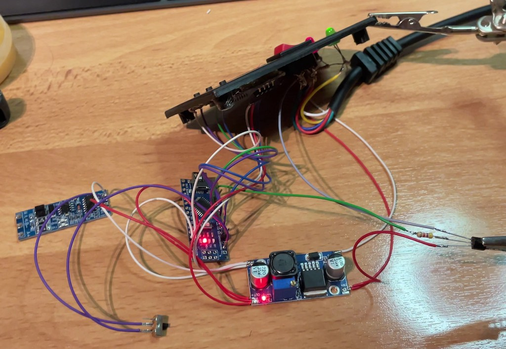
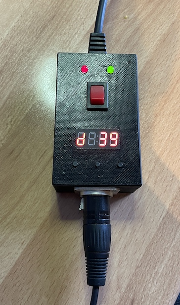

# DMXfog

## Idea
This project came along when I got a not-super-new fog machine with just a wired remote with momentary switch. 
It was bugging to always be next to the remote to press it for some seconds to keep a steady-slight fog during an event. 
With lights controlled by DMX, the idea came to build a new remote which can connect to DMX to control to fog machine in a PWM like manner (with two DMX channels indicating frequency and duty cycle).

On top of that a manual timer mode was added in situations where no DMX is available.

The case should be similar to the original remote with its two status LEDs and a momentary push button which I wanted to keep for pure manual operation.

## Features
* Display to show the current mode (DMX or manual) and a countdown to the next action
* DMX mode with two channels (cycle length in seconds and duty cycle in percent)
* Configurable and EEPROM persisted DMX channel
* Manual mode with both parameters set manually
* Auto turn-off when DMX signal is lost
* Parasite power supply trough fog machines current to drive the LEDs which was more than enough

## Hardware
* Arduino Nano (china clone)
* RS485 to TTL converter 
* DC-DC buck converter with LM2596S to step down from fog machine voltage of 12V to Arduino Nano 5V
* 4-digit 7-segment display with TM1637 driver
* some simple 6x6 tactile buttons 

## Build
3D models in sTL format included in the `resources` directory.

How the thing looked like before it come into the box
* RS485 converter on the left, DMX socket not connected
* Remote control on the top
* Arduino Nano in the middle
* buck converter on the bottom
* Transistor on the right to trigger the fog machine (just shorts the 12v supply to the high impedance trigger input of the machine)

After everything was nested into the box

## Props to (Libraries)
* [nickgammon/SendOnlySoftwareSerial](https://github.com/nickgammon/SendOnlySoftwareSerial) for debugging cause DMXSerial uses the hardware serial of the Arduino Nano
* [mathertel/DMXSerial](https://registry.platformio.org/libraries/mathertel/DMXSerial) to receive DMX from a RS485 to TTL converter
* [smougenot/TM1637](https://registry.platformio.org/libraries/smougenot/TM1637) as display driver